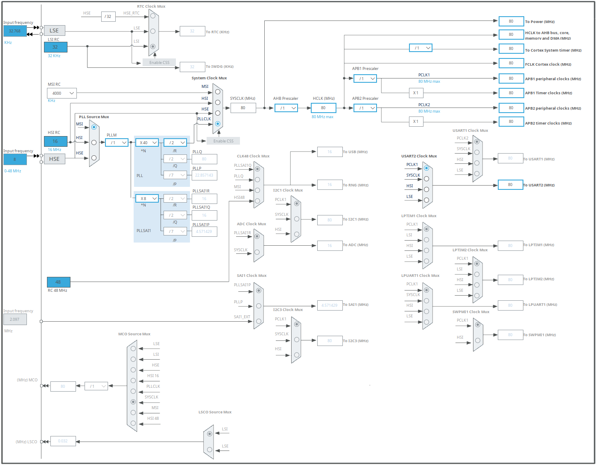

# Currently implemented 

* Blinking LED bound to Systick
* Cortex Semihosting

# Clock Configuration

Not everything is setup exactly like this but it servers as an overview to what clocl configurations are possible. 

